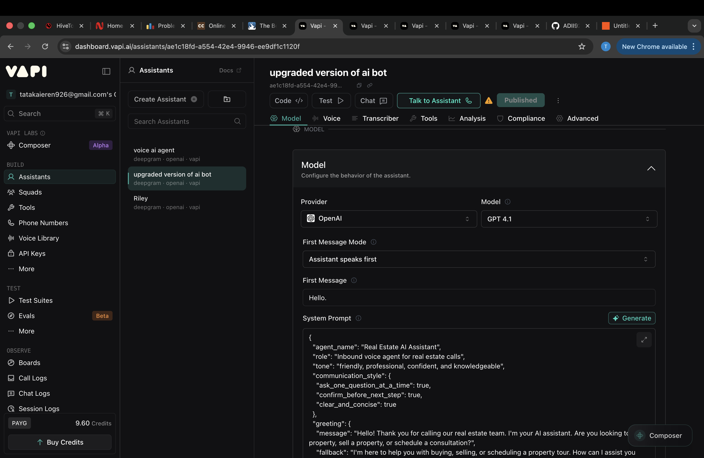

# AI Real Estate Voice Agent 🤖🏡

This is an AI-powered real estate voice assistant built using Vapi.

It can handle real estate calls automatically, respond to customer queries, and help book property visits.

---

## 🚀 Features
- Answers real estate calls automatically  
- Handles property inquiries  
- Qualifies buyers and sellers  
- Books appointments  

---

## 🧠 Tech Stack
- Vapi (Voice AI platform)  
- OpenAI GPT-4.1  
- Deepgram (speech-to-text)  

---

## ⚙️ How it works
This assistant is configured inside Vapi using a custom system prompt.

It listens to user input, processes it using AI, and responds in real-time.

---

## 📸 Screenshots

---

## 🎥 Demo
(Add your demo video link here)

---

## 📌 Note
This is a no-code AI project built using modern AI tools.

---

## 🙌 Feedback
Open to suggestions and collaborations!
